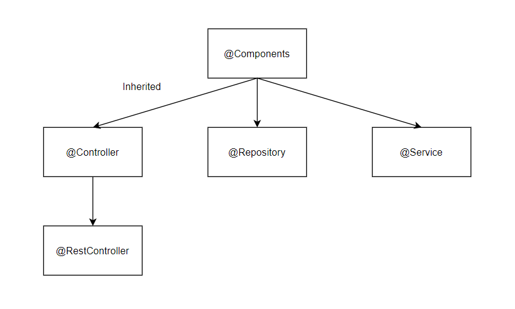

# Spring Configuration

## Introduction

1. There are three prominent ways, to provide configuration to the spring
   1. XML based configuration
   2. Annotation based configuration
   3. Java based configuration
2. **XML Based Configuration**
3. XML based configuration is oldest and most matured way of configuration, and still supported by the framework. 
4. XML configuration takes a little more efforts, but it saves you a lot of time & headache later in big projects.
5. **Annotation Based Configuration**
6. Annotation based configuration is comparatively new approach of spring configuration. It allow user to use ```@``` annotations on classes and methods to classify them as a spring components
7. During starting up of spring application,it performs the component scan and further creating the dependency beans in the application context. When components are configured using annotation based configuration, it get recognized and picked up by the *Component Scan*
8. **Java based Configuration**
9. In this type of configuration A java class being used to define the beans
10. The class which holds the beans is incorporated with ```@Configuration``` annotation
11. And method of such class is incorporated with ```@Bean``` annotation
12. *Note: All the above described ways of spring configuration works with each other. Eg: In same spring application, some configurations can be done using one method along with it some configurations are done using another method*

## Spring framework stereotypes

1. Stereotypes: *something conforming to a fixed or general pattern; especially : a standardized mental picture that is held in common by members of a group and that represents an oversimplified opinion*

2. When a class is annotated with Stereotypes Spring will automatically register them in the application context. This makes the class available for dependency injection in other classes.

3. Available stereotypes

   1. ```@Component``` : Dictate the spring to create a bean of the class which has this annotation and keep it in context 
   2. ```@Controller``` : If class has this annotation with it, then Spring will treat the class as a MVC controller
   3. ```@RestController``` : Inherited from ```@Controller``` annotation, has ```@ResponseBody```
   4. ```@Repository``` : To declare that the class is emulates the storage capability
   5. ```@Service``` : To declare that the class contain the core business logic

   

## Spring Component Scanning

1. When Spring application starts up, it scans the entire app for different components, to make the bean out of it and store it in the application context. This beans will further be used for dependency injection

2. The default component scan happens in hierarchy, means scanning happens to the child packages of the main method. 

3. Example:

   ~~~powershell
    pet.clinic.web
       └── src
           └── main
               └── java
                   ├── Package1
                   ├── Package2
                   └── CGI.springframework.petclinic
                       ├── Controllers
                       └── MainAppClass
   ~~~

4. In above sample project the default component scan will happen on the controller and spring will not perform any component scan on the Package1 and Package2 Because spring only consider the packages which are child of ```MainAppClass```. Therefore Package1 and Package2 will be excluded by component scan

5. In order to include the Package1 and Package2 in component scanning, we need to specify them in the main class as follow

   ~~~java
   @SpringBootApplication
   @ComponentScan(basePackage={"Package1","Package2", "Controllers"})
   Public Class App{
       // main method
   }
   ~~~

6. Note: When ```@ComponentScan``` annotation is invoked, it override the default component scanning cycle. Therefore Auto scanning is override. Due to this override controllers package is declared explicitly in the ```ComponentScan```

## Java Based Configuration

1. Use `@Configuration` annotation on top of any class to declare that this class provides one or more **@Bean** methods and may be processed by the Spring container to generate bean definitions and service requests for those beans at runtime.

2. Create the service which will be injected in some another class

   ~~~java
   // interface
   public interface DemoManager {
       public String getServiceName();
   }
   ~~~

   ~~~java
   // implementation
   public class DemoManagerImpl implements DemoManager
   {
       @Override
       public String getServiceName(){
           return "demo service";
       }
   }
   ~~~

3. Create the configuration class using ```@Configuration```

   ~~~java
   @Configuration
   public class ApplicationConfiguration {
    
       @Bean(name="demoService")
       public DemoManager helloWorld() {
           // this method returns the instance of the above implemented service
           return new DemoManagerImpl();
       }
   }
   ~~~

4. Obtain the bean in the main method

   ~~~java
   public class VerifySpringCoreFeature
   {
       public static void main(String[] args){
   	    ApplicationContext context = new AnnotationConfigApplicationContext(ApplicationConfiguration.class);
           
           // the bean is obtained here
           DemoManager  obj = (DemoManager) context.getBean("demoService");
           System.out.println( obj.getServiceName() );
       }
   }
   ~~~

5. Please refer : section : **Java based Bean Configuration** of the following project link

   [Java based Bean Configuration](https://github.com/jaySiddhapura-eng/basic-MVC-spring5)


